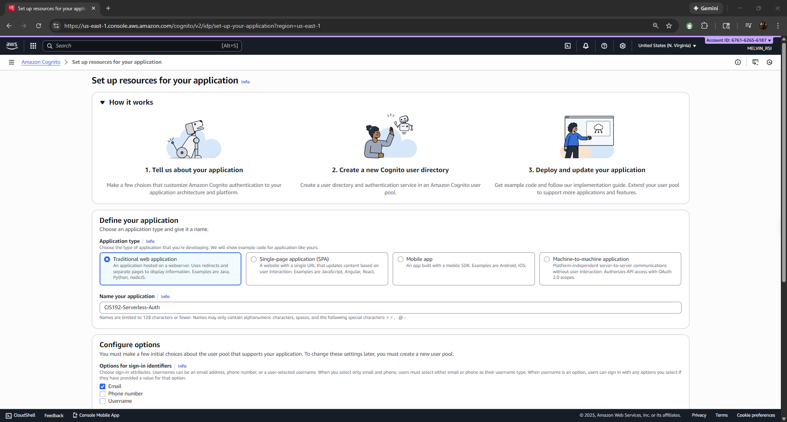
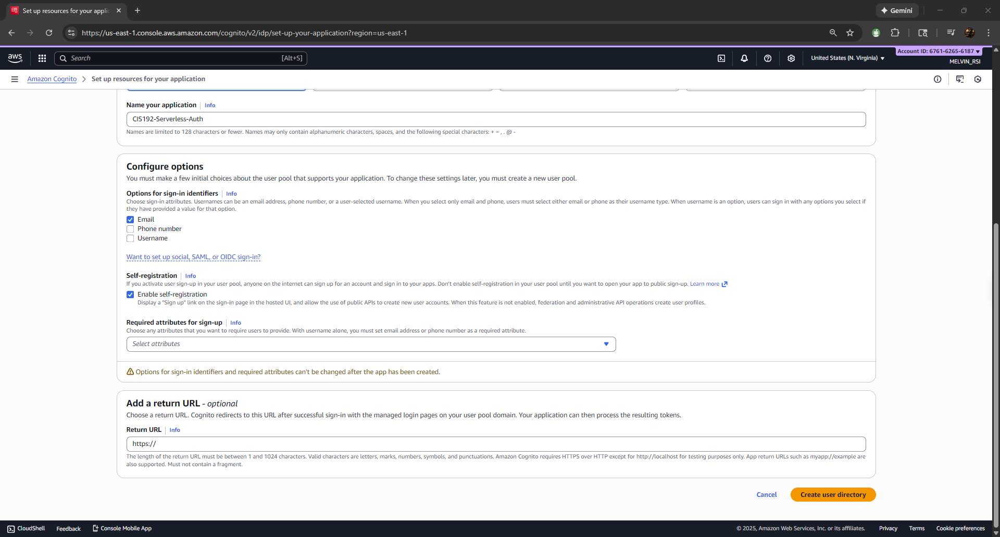
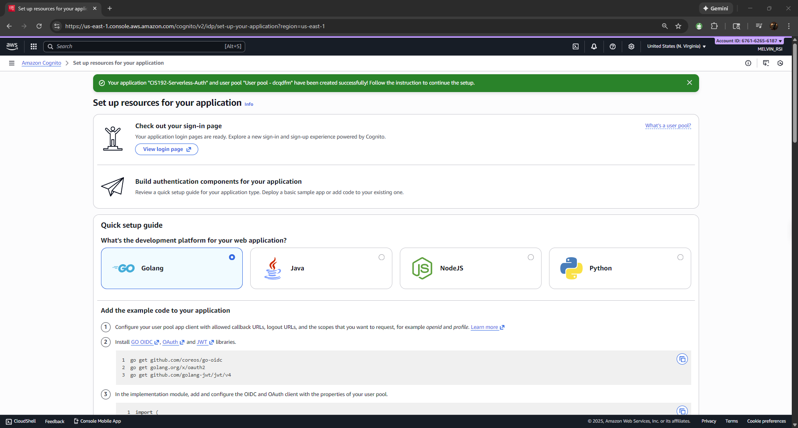
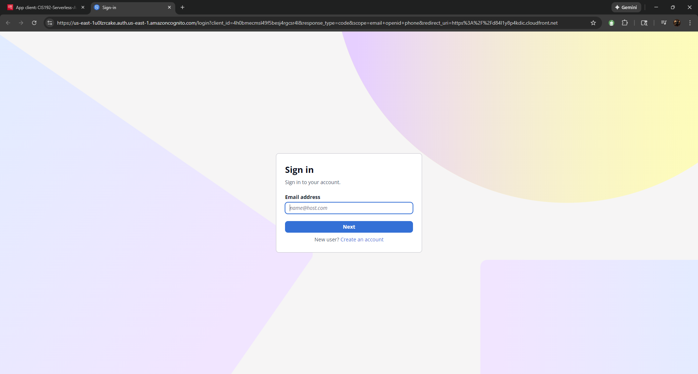
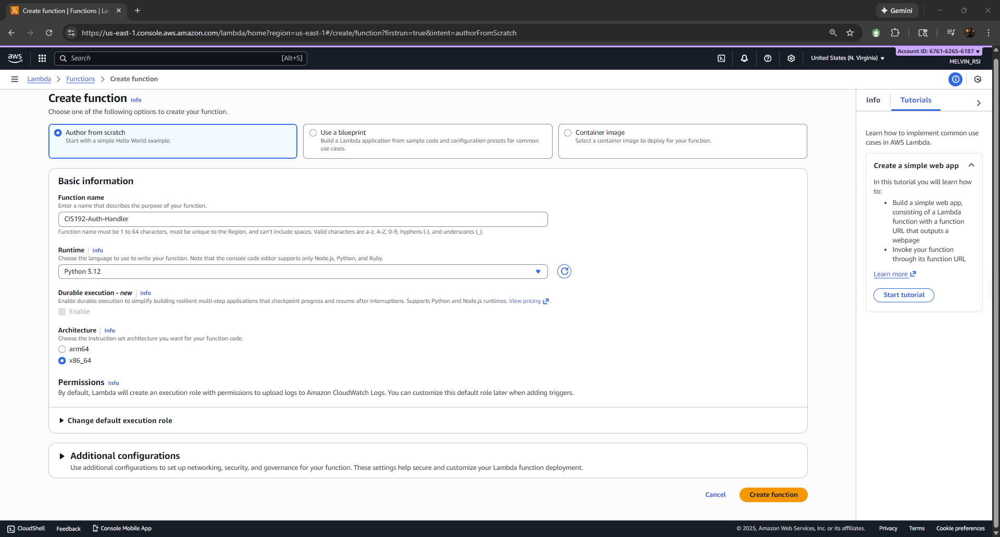
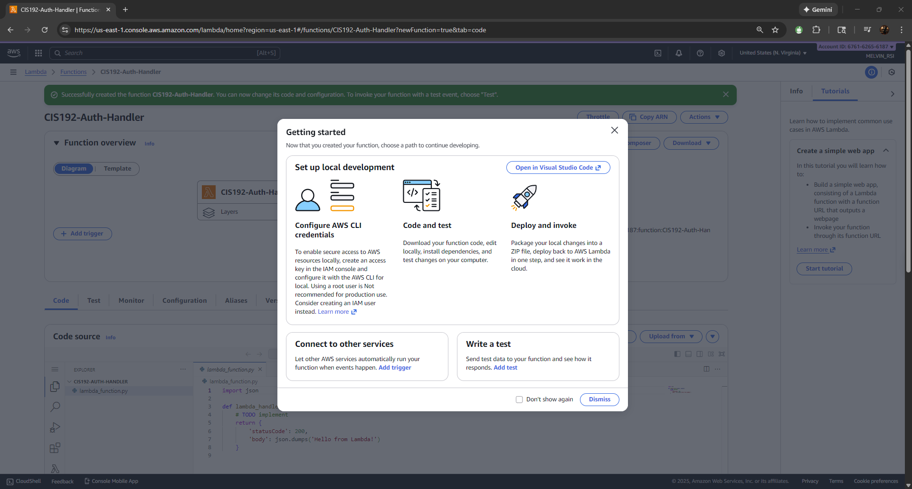
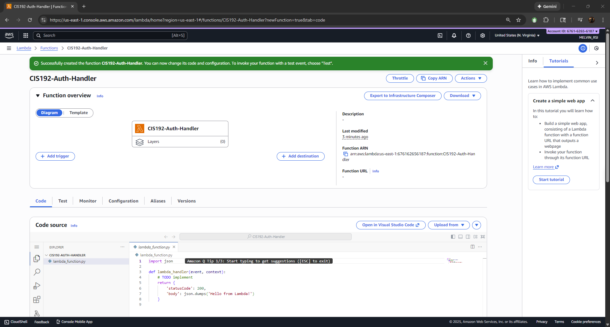
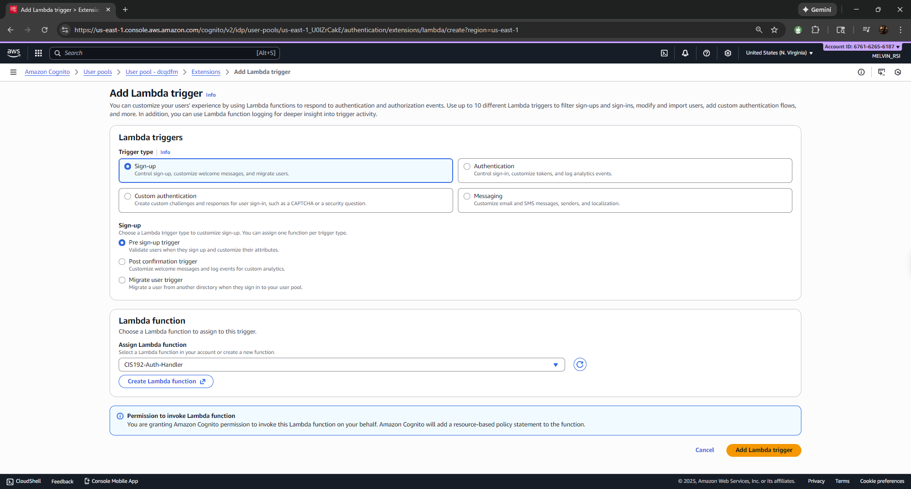

# Sentinel Serverless Authentication

A cloud‑native authentication system demonstrating how serverless identity flows and event‑driven logic can be built on top of modern cloud platforms. It focuses on secure user registration, hosted sign‑in/sign‑up pages, and extensible validation logic using serverless compute. While the examples use Amazon Cognito and AWS Lambda, the concepts and patterns are applicable to any major cloud provider and are designed to integrate with machine learning frameworks.

## Overview

The goal of this project is to provide a modular foundation for building serverless authentication systems. A managed identity service supplies user directories and hosted login flows. A pre‑sign‑up trigger lets you run custom logic during registration, enabling intelligent validation and enrichment. The current implementation uses Cognito for identity and a Python Lambda function for the trigger, but you can adapt these steps to other identity providers or add ML‑driven decisioning via frameworks such as TensorFlow.

## Architecture highlights

- **Managed identity** – user directory, sign‑up, sign‑in and hosted UI, with configurable attributes and self‑registration.
- **Serverless compute** – event‑driven function invoked at sign‑up time, ready to call ML models or custom business rules.
- **Extensibility** – integration points for fraud detection, risk scoring and adaptive security across multiple cloud platforms.

## Setup steps

### 1 – Define your application

In the identity provider’s console, create a new application. Choose the application type (for example, a traditional web app) and give it a descriptive name. Select the allowed sign‑in identifiers (email, phone or username) and check **Enable self‑registration** if you want users to sign up themselves. Provide a return URL where users will be redirected after sign‑in.

### 2 – Configure sign‑in and self‑registration

After naming your application, specify which identifiers (email, phone or username) users may use to sign in. Enabling self‑registration adds a **Sign up** link to the hosted login page. You can also mark certain attributes as required. When finished, create the user directory (user pool).

### 3 – Complete setup and review resources

Once the user pool and application are created, the console displays a success banner and provides a quick setup guide. From here you can view the hosted login page or download example code for your platform (Go, Java, NodeJS or Python). The guide also shows your hosted sign‑in URL.

### 4 – Test the hosted login page

Click **View login page** from the setup guide to open the hosted UI. Users can enter their email address (or other identifier) and either sign in or create an account.

### 5 – Create a serverless function

Navigate to your serverless compute service and create a new function. Author from scratch, give it a name (for example, `SentinelAuthHandler`), and choose your runtime (Python 3.12 in this example). Accept the default execution role.

After creation, the function details page shows a stub `lambda_handler` function that simply returns a JSON response. You can edit this to run custom validation logic, call ML models or enrich user attributes.

You may also be presented with a getting‑started pop‑up describing local development, packaging and deploying your function. Follow the links or dismiss as needed.

### 6 – Attach the pre‑sign‑up trigger

Return to your identity service and go to the **Extensions** or **Triggers** tab of your user pool. Add a new Lambda trigger, select **Sign‑up** and choose **Pre sign‑up trigger**. From the drop‑down list, pick the function you just created or create a new one.

After saving, a green banner confirms that the trigger has been added. The Lambda triggers list shows your pre‑sign‑up trigger associated with the handler function.

## Extending the system

This foundation supports more advanced features:

- **Machine learning validation** – call an ML model (for example, TensorFlow or PyTorch) from the pre‑sign‑up function to flag suspicious registrations.
- **Adaptive authentication** – evaluate risk scores and dynamically require additional factors or captcha for high‑risk users.
- **Multi‑cloud support** – adapt the pattern to other identity providers (Azure AD B2C, Auth0, etc.) while keeping the event‑driven validation logic.

## Conclusion

By following these steps you create a basic serverless authentication system: a user signs up via a hosted UI, and a serverless function validates and enriches their data before registration completes. This architecture is cloud‑agnostic and ready for intelligent extensions, making it a strong starting point for production‑grade identity systems.